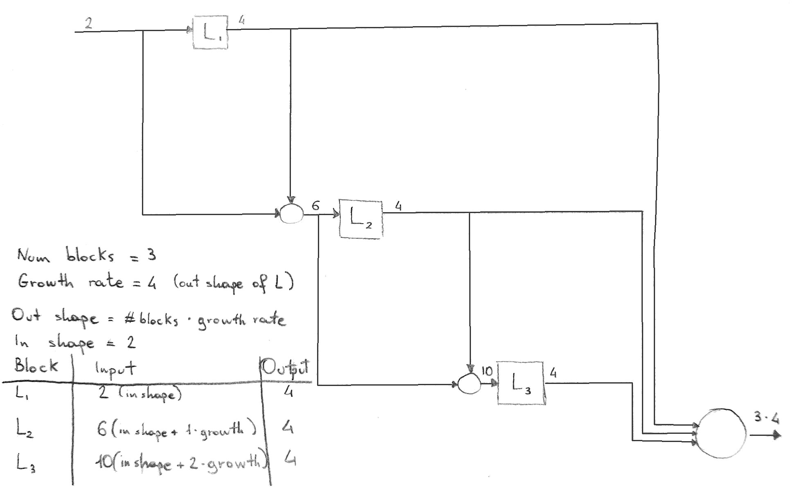

# DenseNet and FCDenseNet

## DenseNet

Paper: [Densely Connected Convolutional Networks](https://arxiv.org/abs/1608.06993)

#### Dense Layers with optional Bottleneck

A Dense Layer does not concatenate the output of its final module to the layer input, as shown in equetion (2) 
from the paper. 
It is up to the containing Dense Block to take care of concatenation, both of inputs and outputs, where needed.

> The l-th layer receives the feature-maps of all preceding layers, `x_0, ..., x_{l−1}`, as input:
```
x_l = H_l([x0, x1, ..., x_{l−1}])
``` 
> where `[x0, x1, ..., x_{l−1}]` refers to the concatenation of the feature-maps produced in layers `0, ..., l−1`

The Dense Layer behaves as a normal `torch.nn.Sequential` module, with an optional bottleneck block:

> It has been noted that a 1×1 convolution can be introduced as bottleneck layer before each 3×3 convolution
  to reduce the number of input feature-maps, and thus to improve computational efficiency. 
  We find this design especially effective for DenseNet and we refer to our network with such a bottleneck layer, 
  i.e. to the BN-ReLU-Conv(1×1)-BN-ReLU-Conv(3×3) version of Hl, as DenseNet-B. 
  In our experiments, we let each 1×1 convolution produce 4k feature-maps.
  
The optional bottleneck makes the structure of a Dense Layer look as follows: 

```
- Batch Normalization
- ReLU
- (Bottleneck)
  - 1x1 Convolution (4k filters)
  - Batch Normalization
  - ReLU
- 3x3 Convolution (k filters)
- (Dropout)
```

#### Dense Blocks

Following the [original implementation](https://github.com/liuzhuang13/DenseNet):

> If each function `H_l` produces `k` feature maps, it follows that the l-th layer has `k_0 + k * (l−1)` 
  input feature-maps, where `k_0` is the number of channels in the input layer. 
  \[...\] 
  We refer to the hyperparameter `k` as the growth rate of the network.

- A Dense Block consists of several DenseLayer (possibly with Bottleneck and Dropout) with the same output shape
- The first DenseLayer is fed with the block input
- Each subsequent DenseLayer is fed with a tensor obtained by concatenating the input and the output
  of the previous DenseLayer on the channel axis
- The block output is the concatenation of the output of every DenseLayer, and optionally the block input,
  so it will have a channel depth of `growth_rate * num_layers` or `growth_rate * num_layers + in_channels`
  


#### Transition Layers
> We refer to layers between blocks as transition
  layers, which do convolution and pooling. The transition
  layers used in our experiments consist of a batch normalization
  layer and an 1×1 convolutional layer followed by a
  2×2 average pooling layer
  
> To further improve model compactness,
  we can reduce the number of feature-maps at transition
  layers. If a dense block contains m feature-maps, we let
  the following transition layer generate `[θm]` output feature maps,
  where `0<θ≤1` is referred to as the compression factor
  
This description correspondes to the following layers:

```
- Batch Normalization
- ReLU
- 1x1 Convolution (θm filters)
- Average Pooling
```

## FCDenseNet

Paper: [The One Hundred Layers Tiramisu: Fully Convolutional DenseNets for Semantic Segmentation](https://arxiv.org/abs/1611.09326)

#### Dense Blocks
> Dense block layers are composed of BN, followed by ReLU, a 3 × 3 'same' convolution (no resolution loss) 
  and dropout with probability p = 0.2. The growth rate of the layer is set to k = 16
  
> Since the upsampling path increases the feature maps spatial resolution, the linear growth in the number of features
  would be too memory demanding, especially for the full resolution features in the pre-softmax layer. 
  In order to overcome this limitation, the input of a dense block is not concatenated with its output

- In the architecture of a Dense Block from the FCDenseNet paper there is no mention of a Bottleneck layer
- Difference between downward and upward paths:
    - In the _downward_ path, each Dense Block concatenates the outputs of its Dense Layers to the input 
      (Output channels: `growth_rate * num_layers + in_channels`)
    - In the _upward_ path, each Dense Block only concatenates the outputs, dropping the block input
      (Output channels: `growth_rate * num_layers`)

#### Transition Down
> A transition down is introduced to reduce the spatial dimensionality
  of the feature maps. Such transformation is composed of a 1×1 convolution 
  (which conserves the number of feature maps) followed by a 2 × 2 pooling operation.
  
Differences from the Transition Layer in DenseNet:
- TransitionDown blocks do not change the number of channels, i.e. no "compression" is performed
- TransitionDown blocks might include a Dropout layer
- TransitionDown blocks use Max Pooling instead of Average Pooling

```
- Batch Normalization
- ReLU
- 1x1 Convolution (preserving the number of channels)
- (Dropout)
- Max Pooling
```