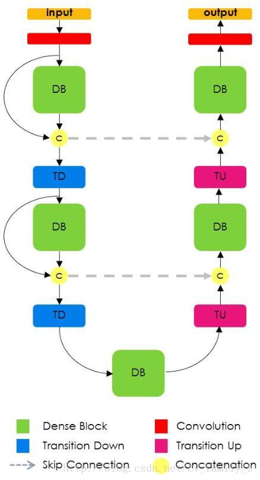

# DenseNet and FCDenseNet

A [PyTorch](http://pytorch.org/) implementation of the DenseNet and FCDenseNet architectures from the papers:
- [Densely Connected Convolutional Networks](https://arxiv.org/abs/1608.06993)
  by Gao Huang, Zhuang Liu, Laurens van der Maaten, Kilian Q. Weinberger
- [The One Hundred Layers Tiramisu: Fully Convolutional DenseNets for Semantic Segmentation](https://arxiv.org/abs/1611.09326)
  by Simon Jégou, Michal Drozdzal, David Vazquez, Adriana Romero, Yoshua Bengio

The goal of this package is to provide a nice and simple object-oriented implementation of the two architectures.
The individual submodules are cleanly separated into self-contained blocks, that come with documentation and typings,
and that are therefore easy to import and reuse.

## Requirements and installation

The minimal requirements for the library are Python 3.6+ and PyTorch 1.1+.

A conda environment as such is recommended:
```bash
conda create --name densenet python=3.7
conda install --name densenet -c pytorch pytorch torchvision
```

Within the correct environment, install the package from GitHub:
```bash
conda activate densenet
pip install git+https://github.com/baldassarreFe/pytorch-densenet-tiramisu
```

For training and development, do:
```bash
conda env create -f conda.yaml
conda activate densenet
git clone https://github.com/baldassarreFe/pytorch-densenet-tiramisu
pip install --editable pytorch-densenet-tiramisu
pytest pytorch-densenet-tiramisu
```
## Usage

Either load a predefined network:
```Python
from dense import FCDenseNet103
from dense.utils import count_parameters, count_conv2d

net = FCDenseNet103()
print('Layers:', count_conv2d(net))
print('Parameters:', count_parameters(net))
```
```
Layers: 103
Parameters: 17236944
```

Or use the modules for your custom architecture:
```Python
from torch.nn import Sequential
from dense import DenseLayer, DenseBlock

class AwesomeModule(Sequential):
    def __init__(self, in_channels, out_channels):
        super(AwesomeModule, self).__init__()

        self.block = DenseBlock(in_channels, growth_rate=4, num_layers=2,
                                concat_input=True, dense_layer_params={'dropout': 0.2})

        self.layer = DenseLayer(self.block.out_channels, out_channels, bottleneck_ratio=2)

awesome = AwesomeModule(10, 4)
print(awesome)
```
```
AwesomeModule(
  (block): DenseBlock(10, 2*4+10=18)(
    (layer_0): DenseLayer(10, 4)(
      (norm): BatchNorm2d(10, eps=1e-05, momentum=0.1, affine=True)
      (relu): ReLU(inplace)
      (conv): Conv2d(10, 4, kernel_size=(3, 3), stride=(1, 1), padding=(1, 1), bias=False)
      (drop): Dropout2d(p=0.2, inplace)
    )
    (layer_1): DenseLayer(14, 4)(
      (norm): BatchNorm2d(14, eps=1e-05, momentum=0.1, affine=True)
      (relu): ReLU(inplace)
      (conv): Conv2d(14, 4, kernel_size=(3, 3), stride=(1, 1), padding=(1, 1), bias=False)
      (drop): Dropout2d(p=0.2, inplace)
    )
  )
  (layer): DenseLayer(18, 4)(
    (norm): BatchNorm2d(18, eps=1e-05, momentum=0.1, affine=True)
    (relu): ReLU(inplace)
    (bottleneck): Bottleneck(18, 8)(
      (conv): Conv2d(18, 8, kernel_size=(1, 1), stride=(1, 1), bias=False)
      (norm): BatchNorm2d(8, eps=1e-05, momentum=0.1, affine=True)
      (relu): ReLU(inplace)
    )
    (conv): Conv2d(8, 4, kernel_size=(3, 3), stride=(1, 1), padding=(1, 1), bias=False)
  )
)
```

## Architecture overview

### DenseNet

> DenseNet is a network architecture where each layer is directly connected to every other layer
  in a feed-forward fashion (within each dense block). For each layer, the feature maps of all
  preceding layers are treated as separate inputs whereas its own feature maps are passed
  on as inputs to all subsequent layers.

The building block of DenseNet is a densely connected block, that leverages skip connections between
the internal layers to facilitate the flow of information and gradients:


Several blocks can be arranged in a sequence, interleaved by layers that scale down
the size of the feature maps, with the aim of performing image classification.


### FCDenseNet

> FCNs are built from a downsampling path, an upsampling path and skip connections.
  Skip connections help the upsampling path recover spatially detailed information from the downsampling path, by
  reusing features maps. The goal of our model is to further exploit the feature reuse by extending the more sophisticated
  DenseNet architecture, while avoiding the feature explosion at the upsampling path of the network.



## Implementation details

### DenseNet

The implementation of DenseNet and its components references
the Torch [implementation](https://github.com/liuzhuang13/DenseNet) by the original original authors,
and the PyTorch [implementation](https://github.com/pytorch/vision/blob/master/torchvision/models/densenet.py) from torchvision,
with some differences that illustrated and justified below.

#### Dense Layers with optional Bottleneck

Equation 2 from the paper shows that the output of a Dense Layer does not comprise the concatenation of its input,
therefore a Dense Layer can be implemented as normal `torch.nn.Sequential` module.
In the context of a DenseNet, it's up to the containing Dense Block to take care of concatenating
the input and the output of its Dense Layers.

> The l-th layer receives the feature-maps of all preceding layers, `x_0, ..., x_{l−1}`, as input:
```
x_l = H_l([x0, x1, ..., x_{l−1}])
```
> where `[x0, x1, ..., x_{l−1}]` refers to the concatenation of the feature-maps produced in layers `0, ..., l−1`

An optional bottleneck block, based on a 1x1 convolution, can be added to reduce the number of parameters
and the memory consumption of a forward/backward pass:

> It has been noted that a 1×1 convolution can be introduced as bottleneck layer before each 3×3 convolution
  to reduce the number of input feature-maps, and thus to improve computational efficiency.
  We find this design especially effective for DenseNet and we refer to our network with such a bottleneck layer,
  i.e. to the BN-ReLU-Conv(1×1)-BN-ReLU-Conv(3×3) version of Hl, as DenseNet-B.
  In our experiments, we let each 1×1 convolution produce 4k feature-maps.

With the addition of such bottleneck and an optional dropout layer, a Dense Layer has the following stucture:
```
- Batch Normalization
- ReLU
- (Bottleneck)
  - 1x1 Convolution (4k filters)
  - Batch Normalization
  - ReLU
- 3x3 Convolution (k filters)
- (Dropout)
```

#### Dense Blocks

The following sketch illustrates the architecture of a Dense Block as implemented in this project,
note how in this case the block input was not concatenated to form the block output:


> If each function `H_l` produces `k` feature maps, it follows that the `l-th` layer has `k_0 + k * (l−1)`
  input feature-maps, where `k_0` is the number of channels in the input layer.
  \[...\]
  We refer to the hyperparameter `k` as the growth rate of the network.

A Dense Block consists of several Dense Layers (possibly with Bottleneck and Dropout), all having the same output shape:
- The first DenseLayer is fed with the block input
- Each subsequent Dense Layer is fed with the concatenation of the input and the output
  of the previous Dense Layer (on the channel axis)
- The output of the block is the concatenation of the outputs of every Dense Layer, and _optionally_ the block input

Depending on whether the block input is concatenated or not with the outputs of the layers,
the block output will have a channel depth of either `growth_rate * num_layers` or `growth_rate * num_layers + in_channels`

#### Transition Layers

Transition layers are placed between each pair of Dense Blocks, with the purpose of
halving the width and height of the feature maps and optionally reducing the number of channels.

> We refer to layers between blocks as transition
  layers, which do convolution and pooling. The transition
  layers used in our experiments consist of a batch normalization
  layer and an 1×1 convolutional layer followed by a
  2×2 average pooling layer

> To further improve model compactness,
  we can reduce the number of feature-maps at transition
  layers. If a dense block contains m feature-maps, we let
  the following transition layer generate `[θm]` output feature maps,
  where `0<θ≤1` is referred to as the compression factor

A Transition block can be implemented with a `torch.nn.Sequential` module composed of:
```
- Batch Normalization
- ReLU
- 1x1 Convolution (θm filters)
- 2x2 Average Pooling
```

### FCDenseNet

The implementation of FCDenseNet and its components references
the Lasagne [implementation](https://github.com/SimJeg/FC-DenseNet) by the original original authors,
and the PyTorch [notebooks](https://github.com/bfortuner/pytorch_tiramisu) by bfortuner,
with some differences that illustrated and justified below.

#### Dense Blocks

> Dense block layers are composed of BN, followed by ReLU, a 3 × 3 'same' convolution (no resolution loss)
  and dropout with probability p = 0.2. The growth rate of the layer is set to k = 16

> Since the upsampling path increases the feature maps spatial resolution, the linear growth in the number of features
  would be too memory demanding, especially for the full resolution features in the pre-softmax layer.
  In order to overcome this limitation, the input of a dense block is not concatenated with its output

FCDenseNet can fully reuse the Dense Block implemented for DenseNet, considering that:
- the FCDenseNet paper does not make use of Bottleneck layers in tits Dense Blocks
- In the _downward_ path, each Dense Block concatenates the outputs of its Dense Layers to the block input
  (Output channels: `growth_rate * num_layers + in_channels`)
- In the _upward_ path, each Dense Block only concatenates the outputs, dropping the block input
  (Output channels: `growth_rate * num_layers`)

#### Transition Down

> A transition down is introduced to reduce the spatial dimensionality
  of the feature maps. Such transformation is composed of a 1×1 convolution
  (which conserves the number of feature maps) followed by a 2 × 2 pooling operation.

A Transition Down block is implemented with a `torch.nn.Sequential` module:
```
- Batch Normalization
- ReLU
- 1x1 Convolution (preserving the number of channels)
- (Dropout)
- 2x2 Max Pooling
```

Differences from the Transition layer in DenseNet:
- TransitionDown blocks use Max Pooling instead of Average Pooling
- TransitionDown blocks might include a Dropout layer
- TransitionDown blocks do not change the number of channels, i.e. no "compression" is performed,
  however the implementation accepts a `compression` parameter that behaves similarly to DenseNet

#### Middle block

The layer placed at the bottom part of the network is a regular Dense Block, but it's worth noting that:
- in the paper it is indicated as a "bottleneck" block, but the FCDenseNet class uses "middle"
  as a field name to avoid confusion with the optional Bottleneck of Dense Layers
- in figure 1 of the paper (reported above), it appears that this Dense Block does not concatenate
  its input to the output, but the channel count in table 2 only results correct if such concatenation performed,
  which is also what this implementation uses

#### Transition Up and skip connections

In the _upward_ path, the feature volume produced by a Dense Block is scaled up with a transposed convolution
and then concatenated with the feature volume produced by the corresponding Dense Block in the _downward_ path.

Due to the pooling operations happening in the Transition Down layers, it is possible that the feature maps
to be concatenated do not perfectly match in width and height. If this happens, the feature maps are centrally
aligned and then the non-overlapping areas are cropped out. This operation is implemented separately in the
`CenterCropConcat` layer and can be reused in similar situations.

## Bugs and contributions

If you find a bug, or would like to see a feature implemented, feel free to
[create an issue](https://github.com/baldassarreFe/pytorch-densenet-tiramisu/issues/new).

Of course, help and contributions are welcome!

This is the general workflow:
- fork this repository from GitHub
- clone your fork locally
- set up the conda environment
- pip-install the package in 'development' mode
- commit your changes to a feature branch
- push to your fork
- open a pull request!

```bash
git clone https://github.com/<your username>/pytorch-densenet-tiramisu
cd pytorch-densenet-tiramisu
conda env create --file densenet.yml
source activate densenet
pip install -e .
git checkout -b <feature branch>
...
<develop, test, commit, repeat>
...
git push --set-upstream origin <feature branch>
```

## Thanks

The code for this package was originally inspired by the following sources:
- the author's [implementation](https://github.com/liuzhuang13/DenseNet) of DenseNet in Torch
- the torchvision [implementation](https://github.com/pytorch/vision/blob/master/torchvision/models/densenet.py) of DenseNet in PyTorch
- the author's [implementation](https://github.com/SimJeg/FC-DenseNet) of FCDenseNet in Lasagne
- bfortuner's [notebooks](https://github.com/bfortuner/pytorch_tiramisu) on FCDenseNet in PyTorch

## License

The package is provided _as is_, under the conditions of the MIT [license](LICENSE).
